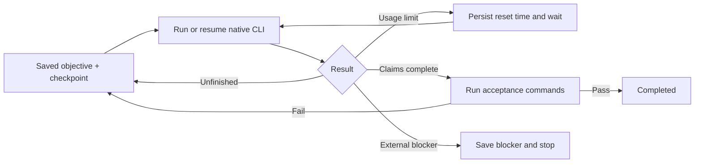

# TinkerTom

Launch **Codex CLI or Claude Code's own terminal UI** with local token-reduction tools and a quota-reset supervisor. Both `tinkertom` and `TinkerTom` work from your current project directory. The optional `start`/`chat` commands provide a separate persistent task runner with acceptance checks.

## Quick start

```sh
source ~/.zshrc          # once after setup in an already-open zsh
cd /path/to/project
tinkertom codex          # actual Codex UI; enter prompts and /commands there
TinkerTom claude         # actual Claude Code UI
tinkertom               # defaults to Codex
tinkertom codex --model MODEL
tinkertom codex resume SESSION_ID
tinkertom claude --resume SESSION_ID
tinkertom native-status
tinkertom doctor
```

`setup.sh` configures the shell integration in your local `~/.zshrc` or `~/.bashrc`. Native mode defaults to the requested YOLO permissions unless the project explicitly configures `permissions`; `--tt-standard` uses provider permission prompts. Arguments after the provider go to that provider. There is no `Task for codex:` prompt or TinkerTom chat screen in native mode.

For root-mode Claude, TinkerTom supplies the requested `IS_SANDBOX=1` together with `--dangerously-skip-permissions`, including on automatic retries. The variable is scoped to Claude's process environment; it does not create an OS sandbox. `--tt-standard` selects normal provider permissions.

The native UI loads a local **TinkerTom MCP server** with RTK/Headroom command compression, focused file reads, Python symbol navigation, local cooldown status, smaller-model coding workers, opposite-provider rubber-duck reviews, and Beads task/memory tools. Claude also receives the simple-Bash optimization hook. Codex receives guidance to use the MCP tools; its built-in shell is not forcibly intercepted. Your existing global provider files aren't rewritten.

| Main UI | Coding worker | Rubber duck |
| --- | --- | --- |
| `tinkertom codex` | Codex GPT-5.6 Luna | Claude Code Opus 4.6 |
| `tinkertom claude` | Claude Code Sonnet | Codex GPT-5.6 Sol |

Your chosen main model coordinates and reviews. Helpers use the installed CLIs and existing login sessions. Beads stores tasks, dependencies and durable discoveries locally. See [workflow, configuration and cost controls](docs/agents.md). Restart an already-running launcher to load the updated bridge and tool list.

On a recognized quota failure, the wrapper saves a deadline, waits for the normal reset and continues the exact session. It does not type into quota dialogs, claim resets, call `/usage`, enable extra usage or switch billing routes. Codex stays in its native UI through a local app-server bridge. Claude stays in its UI during the wait, then the launcher reopens the same session with a continuation prompt. See [native UI details and limits](docs/native.md).

Keep the launcher and machine running. For a detachable **native UI**, run it inside tmux:

```sh
tmux new -s tinkertom
tinkertom codex
# Detach: Ctrl-B, then D. Return: tmux attach -t tinkertom
```

For the optional headless supervisor or custom task chat:

```sh
tinkertom start --provider codex "Implement SPEC.md" --verify 'npm test' --detach
tinkertom chat --provider claude "Fix the failing tests"
tinkertom attach TASK_ID
tinkertom send TASK_ID "Also update the documentation"
```

`--detach` belongs to `start`, not native mode. See [task chat and messaging](docs/chat.md).

## Installation

```sh
cd /path/to/TinkerTom
./setup.sh
source ~/.zshrc                    # bash: source ~/.bashrc
tinkertom doctor
```

Python 3.11+ and Git are required. You do not need to activate the venv for later use: the installer writes launchers bound to the Python that installed them.

For an explicit installation without a venv:

```sh
cd /path/to/TinkerTom
./setup.sh --system
source ~/.zshrc                    # or open a new terminal
tinkertom doctor
```

`--system` passes `--break-system-packages` to pip for the selected Python and installs TinkerTom plus its Python dependencies. It requires pip with that option and permission to install packages; choose a writable Python or run with the necessary privileges. Run it outside any activated venv. It can change packages used by other programs. RTK, Beads and source clones still live in the checkout's `.tools/` directory. Keep the checkout: the Python package is installed in editable mode. The installer doesn't install the provider CLIs or transfer logins.

Setup detects zsh or bash from `SHELL`, then adds or updates one managed block in the corresponding startup file while preserving other settings. It enables `tinkertom claude`, `tinkertom codex`, `TinkerTom`, `tinkertom-claude` and `tinkertom-codex` from your current project directory. The sourced file derives its install path from its own location and supports both installation modes. Re-running setup does not duplicate its managed block. New terminals load the commands automatically; setup cannot change the environment of an already-open parent shell, so source its startup file once or open a new terminal.

Use `./setup.sh --python /path/to/python3.13` to select an interpreter, or `--no-shell` to leave shell startup files unchanged. Unsupported shells also leave startup files unchanged; add the checkout's `.tools/bin` to PATH manually. The lower-level `.venv/bin/python scripts/install-tools.py` and `python3 scripts/install-tools.py --system` remain available. They leave shell files unchanged unless passed `--shell zsh` or `--shell bash`.

The pinned automatic binary installation currently targets Linux x86_64 (including x86_64 WSL2). Other platforms require Rust/Cargo for RTK and a platform-compatible Beads executable at `.tools/bin/bd`; changing Python installation mode does not change platform support.

Install and sign into the provider CLI you intend to use, using the official [Codex documentation](https://developers.openai.com/codex/cli/) or [Claude Code setup guide](https://code.claude.com/docs/en/setup). The runner inherits the CLI's existing authentication, model defaults, configuration, MCP servers and relevant repository instructions. Your configured credentials determine subscription versus API billing; the wrapper does not switch billing modes.

Start a task in a target project (put `-C` before the subcommand):

```sh
tinkertom -C /path/to/project init --permissions yolo
tinkertom -C /path/to/project start \
  "Implement the feature in SPEC.md and fix all relevant tests" \
  --provider codex --verify 'npm test' --verify 'npm run build' --detach
```

For Claude Code, use `--provider claude`. `--task-file /path/to/task.md` accepts a longer specification instead of a positional objective. Choose appropriate acceptance commands for your project; the npm commands above are examples.

This checkout already has `tinkertom.toml` with the requested YOLO preference and its Python test suite as the acceptance command. `init` deliberately refuses to overwrite an existing configuration.

```sh
tinkertom -C /path/to/project list
tinkertom -C /path/to/project status TASK_ID
tinkertom -C /path/to/project stop TASK_ID
tinkertom -C /path/to/project resume TASK_ID --detach
```

`TASK_ID` is the 12-character ID printed at startup. Lowercase `tinkertom start` without `--detach` runs the worker in the foreground; Ctrl-C stops that worker. In the explicit `tinkertom chat` view, Ctrl-C or `/detach` leaves the background worker running. `/stop` or `TinkerTom stop TASK_ID` pauses the worker. Logs are in `.tinkertom/tasks/TASK_ID/runner.log`. Wait for `status` to show `paused` before resuming or handing off.

## Headless task continuation and completion



- **Usage windows:** explicit reset timestamps and retry delays take precedence, with a 30-second buffer. Otherwise, wait five hours from detection. Longer reset timestamps are respected. Ambiguous local clock messages fall back to `cooldown_seconds`. No account rotation, quota bypass, or paid fallback is performed.
- **Wait-only quota policy:** no `/usage`, `/usage-credits`, `/extra-usage`, manual reset/claim, purchasing credits, or enabling overage. The optional task chat does not forward provider slash commands; native mode exposes the provider commands to the user. Ordinary requests may still count toward weekly allowances; the wrapper cannot decouple provider counters or override existing account billing settings. An exhausted weekly allowance also needs its normal reset. New messages and process restarts preserve cooldowns.
- **Native resume:** exact Codex thread IDs and Claude session IDs are saved immediately when emitted. Sessions are never selected with “most recent.” Existing interactive sessions can be adopted with `start "objective" --provider codex --session SESSION_ID`; stop the interactive session first.
- **Recovery:** the agent updates `checkpoint.md` after milestones. Session history, the last report, unchanged working files and full attempt logs remain available. If the native session is missing or its context is exhausted, a new session receives the checkpoint and latest report. An interrupted operation may already have changed files; recovery instructions require inspecting state before retrying.
- **Completion:** the current attempt must return a valid completion report, with no pending steps, and every configured acceptance command must pass. A zero CLI exit code alone is insufficient. With `verify = []`, completion relies on the agent's report; this is explicitly recorded as `agent_report` in state.
- **Real blockers:** authentication/configuration failures, repeated network failures, explicit missing prerequisites and repeated unchanged/malformed reports stop with a saved reason. Usage-limit waits do not consume the failure budget. No runner can guarantee completion when credentials, permissions or necessary requirements are missing.

One supervisor holds a lease for the whole workspace, including cooldowns. Use separate worktrees for concurrent tasks. Child CLIs inherit the lease descriptor to reduce overlap if the supervisor crashes; a CLI that closes inherited descriptors can defeat this protection, so check for orphan processes after an ungraceful shutdown. TinkerTom does not roll back work or provide exactly-once execution of shell side effects.

## Token use

Native session reuse is the default. Short continuation prompts avoid replaying transcripts; checkpoints are read into fresh sessions with a configurable size cap. `status` reports numeric usage fields supplied by the CLI; these are observed values, can omit interrupted work, and are not an authoritative billing ledger. Claude-reported costs are retained when emitted.

**Installed here:** RTK 0.48.0, Headroom 0.37.0 and Beads 1.2.2, with upstream repositories cloned under `.tools/src/`. Versions, source commits and binary download checksums are in `tools.lock.json`. Reinstall using `scripts/install-tools.py` above.

The command-output pipeline uses RTK's supported rewrites, repeated-line reduction, local Headroom compression, then bounded output. It saves captured stdout/stderr plus per-command metrics and preserves command exit codes:

```sh
tinkertom compact --rtk --max-bytes 8000 -- npm test
tinkertom compact -- python3 -m unittest discover -s tests -v
tinkertom compact --raw -- git diff
tinkertom read app.py --symbol handle_request
tinkertom symbols app.py
tinkertom read src/main.ts --start 40 --end 90
tinkertom savings
rtk gain
```

**Claude:** a per-invocation PreToolUse hook wraps supported simple Bash calls automatically. It leaves compound shells, redirections and shell-state changes alone. **Codex:** instructions direct the agent to the tools; native tool calls are not forcibly intercepted. Built-in Read/Grep tools also bypass the Bash hook. Nothing is installed into global provider settings.

Headroom runs locally on new command output, with neural Kompress disabled and tokenizer vocabularies cached. No compression proxy or alternate API billing route is started. Full conversation histories and cached provider prefixes are left intact. Output compression is lossy; inspect saved logs or use `--raw` for exact data. When RTK runs first, captured logs contain RTK's output, not the original pre-RTK stream. These are measured output reductions, not guaranteed bill savings. See [token reduction details](docs/token-reduction.md), [RTK](https://github.com/rtk-ai/rtk), and [Headroom](https://github.com/headroomlabs-ai/headroom).

Other controls in `tinkertom.toml`:

| Setting | Default | Purpose |
| --- | --- | --- |
| `model` | CLI default | Select an available model without hardcoded pricing assumptions |
| `max_turns` | `0` | Optional total successful-turn cap; `0` is unlimited |
| `max_context_turns` | `0` | Optional fresh-session rotation; leave at `0` to retain native resume/compaction |
| `checkpoint_chars` | `12000` | Bound checkpoint text injected into fresh sessions |
| `max_stalls` | `5` | Stop repeated unchanged progress or malformed reports |
| `max_failures` | `5` | Stop consecutive non-quota CLI failures |
| `turn_timeout_seconds` | `3600` | Stop a hung CLI and retry with saved context |
| `verify_timeout_seconds` | `900` | Bound each acceptance command |
| `cooldown_seconds` | `18000` | Fallback wait when no usable reset timestamp is available |
| `rtk`, `headroom` | `true` | Enable installed output reducers |
| `claude_hook` | `true` | Automatically wrap supported simple Claude Bash calls |
| `beads`, `delegate_coding`, `rubber_duck` | `true` | Enable local task memory, implementation workers and independent critiques |
| `agent_timeout_seconds` | `900` | Bound each helper CLI invocation, excluding quota cooldowns |
| `worker_max_turns` | `8` | Bound successful helper turns before coordinator intervention |

Tasks snapshot their configuration at creation. Editing the project TOML changes future tasks. On an existing task, `resume --model NAME`, `--permissions yolo`, `--executable PATH`, or `--max-turns 0` updates those specific settings. Context rotation can lose useful details and cache benefits; it is optional, not a guaranteed saving.

## Provider handoff

```sh
# Stop first, and wait until status reports paused.
tinkertom -C /path/to/project stop TASK_ID
tinkertom -C /path/to/project status TASK_ID
tinkertom -C /path/to/project resume TASK_ID --provider claude --detach
```

A provider change preserves the objective, files, checkpoint and last report, archives the old session ID, and starts a fresh session on the chosen provider. It clears the old provider's model override, executable override and cooldown. Native conversation history is provider-specific and is not converted. Handoff is explicit; hitting a limit normally waits for the same provider.

## Staying alive

`--detach` survives closing a normal terminal, but the machine must remain awake and the process must remain running. For automatic recovery after a crash or reboot on Linux, use `start --enqueue` with the [systemd example](examples/tinkertom.service) and [service instructions](docs/operations.md). Saved reset deadlines survive restarts; booting the machine does not erase a cooldown. On macOS, a launchd job can supervise the same `resume TASK_ID` command. Native Windows is unsupported; use WSL.

## Permissions

`permissions = "yolo"` passes Codex's sandbox/approval bypass or Claude's permission bypass. This allows broad filesystem and shell access. Use a dedicated account/container or worktree appropriate for the task. Provider and organization policies can still deny operations.

In headless mode, `standard` runs Codex with `workspace-write` and approvals disabled, so operations outside its permissions fail. Claude uses `dontAsk` with Read/Edit/Write/Glob/Grep/Bash allowed; **that Bash allowance is not a filesystem sandbox**. CLI restrictions on root execution or managed environments still apply. Acceptance commands execute as your OS user in both modes.

Logs can contain source code and command output. `.tinkertom/` is ignored in this repository; add it to the target project's `.gitignore` too. No credentials are copied into task records, but tool output can contain sensitive data. Completed-task logs can be deleted manually after you no longer need recovery evidence.

## Development and validation

```sh
.venv/bin/python -m unittest discover -s tests -v
```

Tests cover parser isolation, reset timing, session recovery, acceptance failures, background stop/resume, SIGKILL recovery during cooldown, follow-up delivery, completion races, timeouts, output bounds, exit codes, hooks, real local RTK/Headroom compression, helper routing/caching/cancellation, Beads dependencies/memory, and multiple Codex UI connections. Provider model responses use scripted CLI fixtures. Actual Codex **0.153.4** `/resume`, `/model`, and `/mcp` startup was checked without model prompts. Live authenticated helper calls and full quota-reset tests are left for your project trials.

Provider interfaces were checked against [Codex non-interactive mode](https://developers.openai.com/codex/noninteractive/), [Claude programmatic execution](https://code.claude.com/docs/en/headless), and the [Claude CLI reference](https://code.claude.com/docs/en/cli-reference). Unknown CLI error shapes trigger bounded retries and then a saved blocker; inspect the raw attempt logs when adapting to future CLI changes.
